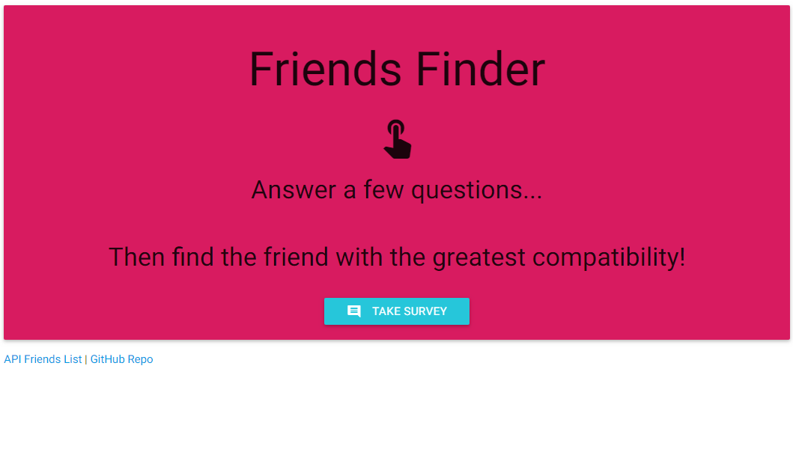
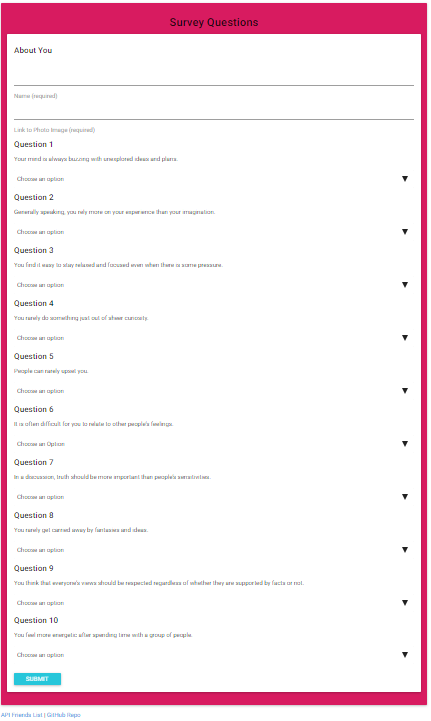
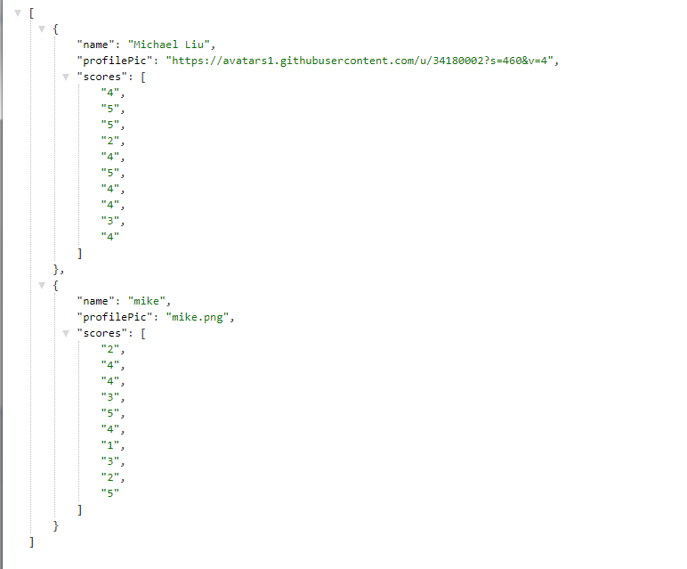

# Friends Finder

The goal was to create a Friend Finder app (essentially a dating app but for friends) using Node and Express servers. The user enters the page that leads to a survey. When the user submits the survey, they are matched with a "friend" that has the closest match to their personality.

## Getting Started
- Clone repo.
- Run command in Terminal or Gitbash 'npm install'
- Run command depending which mode you would like to be on:
    * server.js - node server.js
- Run 'ctrl + c' to exit each mode

## Screen Shots

* Home Page <br>


* Survey Page <br>


* Result Page <br>


* API DATA <br>



## Technologies used
- Node.js
- body-parager NPM Package - https://www.npmjs.com/package/inquirer
- express NPM Package - https://www.npmjs.com/package/express
- CORS NPM package - https://www.npmjs.com/package/cors

### Prerequisites

```
- Node.js - Download the latest version of Node https://nodejs.org/en/
- Materialize - Add CDN link to HTML http://materializecss.com/getting-started.html
```


